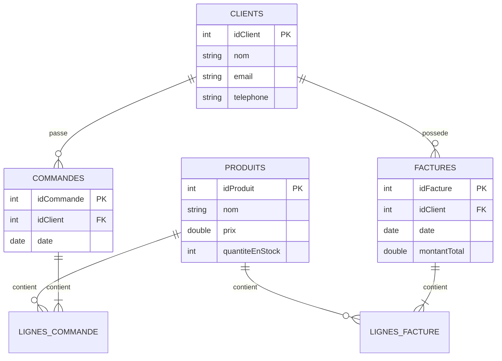

# 📦 Système de Gestion des Commandes et des Factures

Application desktop Java pour la gestion complète des clients, produits, commandes et factures d'une entreprise.

[](https://www.java.com/)
[](https://www.mysql.com/)
[](https://docs.oracle.com/javase/tutorial/uiswing/)

---

## 📋 Table des Matières

- [Fonctionnalités](#-fonctionnalités)
- [Technologies](#-technologies)
- [Prérequis](#-prérequis)
- [Installation](#-installation)
- [Structure de la Base de Données](#-structure-de-la-base-de-données)
- [Utilisation](#-utilisation)
- [Architecture du Projet](#-architecture-du-projet)
- [Captures d'Écran](#-captures-décran)
- [Auteur](#-auteur)

---

## ✨ Fonctionnalités

### 👥 Gestion des Clients
- ✅ Ajouter un nouveau client (nom, email, téléphone)
- ✅ Afficher la liste des clients
- ✅ Modifier les informations d'un client
- ✅ Supprimer un client

### 📦 Gestion des Produits
- ✅ Ajouter un produit (nom, prix, quantité en stock)
- ✅ Consulter le catalogue de produits
- ✅ Modifier les détails d'un produit
- ✅ Supprimer un produit (avec suppression en cascade)

### 🛒 Gestion des Commandes
- ✅ Créer des commandes avec plusieurs lignes
- ✅ Ajouter des produits à une commande
- ✅ Appliquer des remises par ligne
- ✅ Calcul automatique du total
- ✅ Rechercher des commandes (par client ou date)
- ✅ Exporter les commandes en CSV

### 🧾 Gestion des Factures
- ✅ Générer des factures pour les clients
- ✅ Ajouter des lignes de facture
- ✅ Rechercher des factures (par client ou date)
- ✅ Exporter les factures en CSV
- ✅ Calcul automatique du montant total

---

## 🛠️ Technologies

| Technologie | Description |
|------------|-------------|
| **Java** | Langage de programmation principal |
| **Swing** | Framework d'interface graphique |
| **MySQL** | Système de gestion de base de données |
| **JDBC** | Connexion Java-Base de données |
| **Nimbus Look & Feel** | Thème visuel moderne |

---

## 📌 Prérequis

Avant de commencer, assurez-vous d'avoir installé :

- ☕ **Java JDK 11+** : [Télécharger](https://www.oracle.com/java/technologies/downloads/)
- 🗄️ **MySQL Server 8.0+** : [Télécharger](https://dev.mysql.com/downloads/mysql/)
- 🔧 **IDE Java** (Eclipse, IntelliJ IDEA, ou NetBeans)

---

## 🚀 Installation

### 1. Cloner le projet

```bash
git clone <url-du-repository>
cd MINI\ PROJEcT2
```

### 2. Configurer la base de données

Créez la base de données et les tables :

```sql
-- Créer la base de données
CREATE DATABASE gestion_commandes;
USE gestion_commandes;

-- Table clients
CREATE TABLE clients (
    idClient INT AUTO_INCREMENT PRIMARY KEY,
    nom VARCHAR(100) NOT NULL,
    email VARCHAR(100) NOT NULL,
    telephone VARCHAR(20) NOT NULL
);

-- Table produits
CREATE TABLE produits (
    idProduit INT AUTO_INCREMENT PRIMARY KEY,
    nom VARCHAR(100) NOT NULL,
    prix DOUBLE NOT NULL,
    quantiteEnStock INT NOT NULL
);

-- Table commandes
CREATE TABLE commandes (
    idCommande INT AUTO_INCREMENT PRIMARY KEY,
    idClient INT NOT NULL,
    date DATE NOT NULL,
    FOREIGN KEY (idClient) REFERENCES clients(idClient)
);

-- Table lignes_commande
CREATE TABLE lignes_commande (
    idLigne INT AUTO_INCREMENT PRIMARY KEY,
    idCommande INT NOT NULL,
    idProduit INT NOT NULL,
    quantite INT NOT NULL,
    sousTotal DOUBLE NOT NULL,
    FOREIGN KEY (idCommande) REFERENCES commandes(idCommande),
    FOREIGN KEY (idProduit) REFERENCES produits(idProduit)
);

-- Table factures
CREATE TABLE factures (
    idFacture INT AUTO_INCREMENT PRIMARY KEY,
    idClient INT NOT NULL,
    date DATE NOT NULL,
    montantTotal DOUBLE NOT NULL DEFAULT 0,
    FOREIGN KEY (idClient) REFERENCES clients(idClient)
);

-- Table lignes_facture
CREATE TABLE lignes_facture (
    idLigne INT AUTO_INCREMENT PRIMARY KEY,
    idFacture INT NOT NULL,
    idProduit INT NOT NULL,
    quantite INT NOT NULL,
    sousTotal DOUBLE NOT NULL,
    FOREIGN KEY (idFacture) REFERENCES factures(idFacture),
    FOREIGN KEY (idProduit) REFERENCES produits(idProduit)
);
```

### 3. Configurer la connexion à la base de données

Modifiez le fichier `DatabaseManager.java` avec vos identifiants MySQL :

```java
private static final String DB_URL = "jdbc:mysql://localhost:3306/gestion_commandes";
private static final String DB_USER = "votre_utilisateur"; 
private static final String DB_PASSWORD = "votre_mot_de_passe";
```

### 4. Compiler et exécuter

#### Avec Eclipse/IntelliJ IDEA
1. Importer le projet
2. Ajouter le driver MySQL JDBC à votre classpath
3. Exécuter `Accueil.java`

#### En ligne de commande

```bash
#Compiler
javac -d bin src/*.java src/styles/*.java

#Exécuter
java -cp bin:mysql-connector-java.jar Accueil
```

---

## 🗄️ Structure de la Base de Données



---

## 💻 Utilisation

### Démarrage de l'application

1. Lancez l'application via `Accueil.java`
2. Le menu principal s'affiche avec 4 options :
   - **Gestion des Clients**
   - **Gestion des Factures**
   - **Gestion des Commandes**
   - **Gestion des Produits**

### Workflow typique

#### Créer une commande
1. Accédez à **Gestion des Commandes**
2. Cliquez sur **Créer une commande**
3. Sélectionnez un client
4. Ajoutez des lignes de commande :
   - Choisir un produit
   - Indiquer la quantité
   - (Optionnel) Appliquer une remise
5. Cliquez sur **Finaliser Commande**

#### Générer une facture
1. Accédez à **Gestion des Factures**
2. Cliquez sur **Ajouter une Facture**
3. Renseignez l'ID du client et la date
4. Ajoutez des lignes de facture via **Ajouter Ligne Facture**
5. Exportez en CSV si nécessaire

---

## 📂 Architecture du Projet

```
src/
├── Accueil.java                 #Point d'entrée principal
├── DatabaseManager.java         #Gestion connexion DB
│
├── Gestion des Clients/
│   ├── SysGestionClient.java
│   ├── AjouterClient.java
│   ├── AfficherClients.java
│   ├── ModifierClient.java
│   └── SupprimerClient.java
│
├── Gestion des Produits/
│   └── GestionProduitsUI.java
│
├── Gestion des Commandes/
│   └── GestionCommandesUI.java
│
├── Gestion des Factures/
│   ├── GestionFacture.java
│   ├── FactureService.java
│   ├── LigneFactureService.java
│   └── ExportService.java
│
└── styles/
    ├── StyleManager.java
    ├── StyledButton.java
    ├── StyledPanel.java
    └── StyledTable.java
```

### Pattern architectural
- **Module Clients** : Architecture fonctionnelle (1 classe = 1 action)
- **Module Produits/Commandes** : Interface unique avec CardLayout
- **Module Factures** : Architecture en couches (UI + Services)

---


## 🎯 Améliorations Futures

- [ ] Authentification et gestion des utilisateurs
- [ ] Tableaux de bord avec statistiques
- [ ] Impression directe des factures (PDF)
- [ ] Gestion des stocks avec alertes
- [ ] Historique des modifications
- [ ] Tests unitaires (JUnit)
- [ ] Externalisation de la configuration

---

## 👨‍💻 Auteur

**TAHIRI Abdelilah**  


---

## 📄 Licence

Ce projet est développé dans un cadre académique.

---

## 🤝 Contribution

Les contributions sont les bienvenues ! N'hésitez pas à :
1. Fork le projet
2. Créer une branche feature (`git checkout -b feature/AmazingFeature`)
3. Commit vos changements (`git commit -m 'Add some AmazingFeature'`)
4. Push vers la branche (`git push origin feature/AmazingFeature`)
5. Ouvrir une Pull Request

---

## 📞 Support

Pour toute question ou problème, veuillez ouvrir une issue sur GitHub.

---

<div align="center">
  <p>Développé avec ❤️ en Java</p>
  <p>© 2026 TAHIRI Abdelilah - EST BM</p>
</div>
